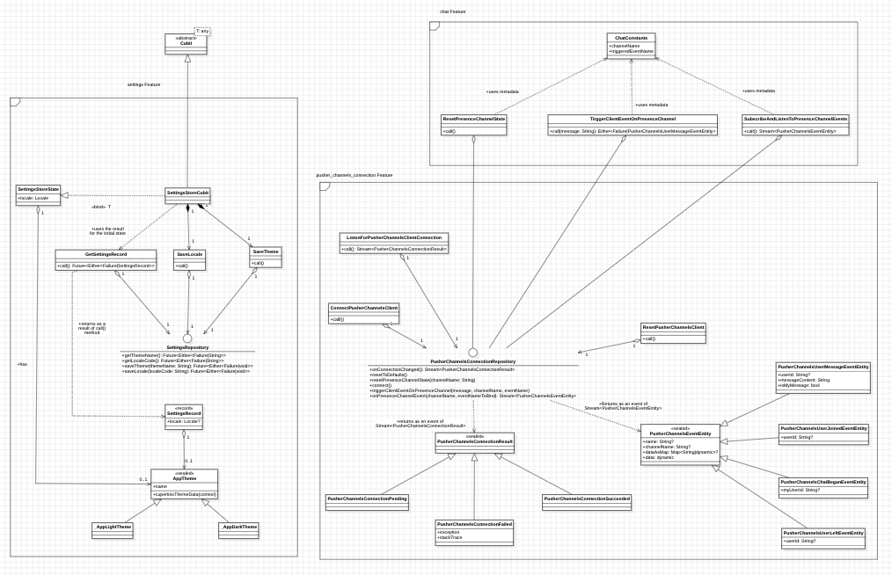
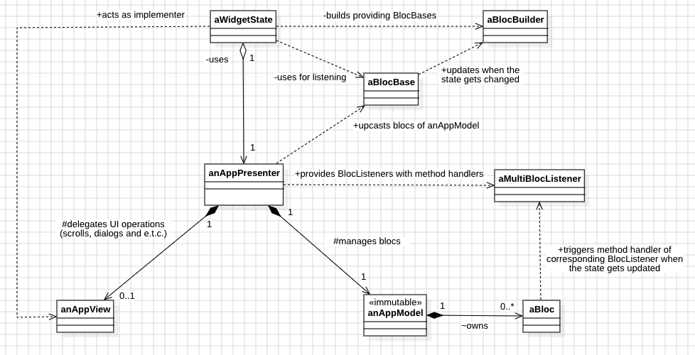

# pusher_channels_test_app

A real-time chat application to showcase [dart_pusher_channels](https://pub.dev/packages/dart_pusher_channels).

## How to test?
Visit [test.pusher.com](https://test.pusher.com), ensure that the cluster set to `mt1`
and try to trigger some messages. In the app's chat room you should be able to see the messages triggered from the website.

# Structure and architecture
- FDD (Feature-Driven-Design) is used as a primary architectural solution.
- MVP (Model-View-Presenter) pattern is used for business logic interactions on the presentation layer. [Bloc](https://pub.dev/packages/flutter_bloc)s are associated with `AppModel` interface implementations.
- [get_it](https://pub.dev/packages/get_it) + [injectable](https://pub.dev/packages/injectable) are used for dependency injection.
- [mockito](https://pub.dev/packages/mockito) framework is used for tests.
- [dart_pusher_channels](https://pub.dev/packages/dart_pusher_channels) is primarily used in the data layer for real-time communications.

## Directory overview

### General
- `core` - contains structures that are used as basis for a whole application.
- `di` - contains the config file generated by `injectable`.
- `localization` - contains helpful structures and utils to work with localization.
- `navigation` - contains `AppNavigator` class and the mixins for routes of general use.

### Feature-specific
#### Data layer
- `[feature_name]/data` - contains structures used for the data layer, such as the client factories, constants or the repository implementations. They are supposed to fulfill all contracts of the domain layer.
- `[feature_name]/data/repositories` - provides implementations for the repository contracts of the domain layer.
- `[feature_name]/data/constants` - contains constant classes with specific static fields, such as URLs and strings.

#### Domain layer
- `[feature_name]/domain/repositories` - major domain contracts (repository interfaces) that are accessed upon calling the use-case classes in the presentation layer.
- `[feature_name]/domain/entities` - static models (real-world entities) that must be returned by the domain contracts.
- `[feature_name]/domain/usecases` - delegates that provide some specific functionality upon using the repository.
- `[feature_name]/domain/stores` - stores that are used to manage some global values. Typically implemented using `Bloc`s.

#### Presentation layer
- `[feature_name]/presentation/blocs` - contains `Bloc`s that are used as parts of instances of `AppModel` class in `MVP` ecosystem.
- `[feature_name]/presentation/widgets` - contains the widgets of general use.
- `[feature_name]/presentation/pages` - contains the page directories where each should contain specific files required per one page.
- `[feature_name]/presentation/[feature_name]_navigator.dart`
  - contains an implementer class which fulfills `PerPageNavigatorMixin` and other dependent route-mixins.
  - provides the route-mixins of pages and dialogs which are associated with the feature.

##### Per-page structure
- `[feature_name]/presentation/pages/[page_name]` - root directory of a specific page.
- `[feature_name]/presentation/pages/[page_name]/[page_name]_model.dart` - class that implements `AppModel` interface. Typically, the model is owned by the presenter. Consists of zero or many instances of `Bloc`.
- `[feature_name]/presentation/pages/[page_name]/[page_name]_view.dart` - contains a contract (interface) that provides methods required by the presenter. For example, showing the dialog messages, scrolling to bottom of the list and e.t.c. Associated with some specific presenter. Extends `AppView` interface.
- `[feature_name]/presentation/pages/[page_name]/[page_name]_presenter.dart` - class that implements `AppPresenter` interface. Owns some specific model and typically does following operations:
  - Provides public read-only (upcasted to `BlocBase<T>`) access to the blocs of the model that will be listened by the widget class.
  - Provides public methods to interact with the encapsulated model's blocs. 
  - Interacts the blocs of the models by a single bloc listener.
  - Uses an implementer of the view contract to react on some events delivered from the model's blocs.
- `[feature_name/presentation/pages/[page_name].dart]` - the stateful widget, the state class of which implements the corresponding view contract and gets bound to the corresponding presenter.

## Screenshots
<p float="left">
  
  
  
  
</p>

## Diagrams

### Static models (Domain class diagram)


### Feature Design Scheme


### Model-View-Presenter object interaction diagram
#### Contracts of `AppPresenter`:
- managing interactions of owned `AppModel`'s blocs internally. (Building and providing handlers to a MultiBlocListener)
- providing public read-only access to owned `AppModel`'s blocs. (Usually, upcasting them to BlocBase).
- providing public methods to trigger corresponding operations of owned `AppModel`'s blocs.

#### Contracts of `AppModel`:
- providing instances of Bloc for a use by a corresponding presenter.

#### Contracts of `AppView`
- providing public methods to interact with UI: showing dialogs, scrolling, navigating to other page and e.t.c.

Typically, a widget state class fulfills the contracts of page-specific interface extending `AppView`. 
Also, it creates an instance of a presenter respectively to the implemented view interface and binds itself to a presenter providing its contracts. So, a widget state **owns** an instance of a presenter and provides contracts of a view for the presenter at the same time.
Example:
```dart
class _ChatPageState extends State<ChatPage> implements ChatPageView {
  // ...
  // Binds itself as an implementer of ChatPageView's contracts
  // So _presenter does not know that it's _ChatPageState, it recognizes "this" as an instance of ChatPageView  
  late final ChatPagePresenter _presenter = ChatPagePresenter.fromEnvironment()
    ..bindView(this);
  //...
  // Provides an implementation to contracts of ChatPageView
  @override
  void scrollToBottom() => _scrollToBottom();
  // ...
  // "Activates" _presenter by wrapping its widget subtree like:
  @Override
  Widget build(){
    return _presenter.buildMultiBlocListener(
            context,
            BlocBuilder<BlocBase<PusherChannelsConnectionState>,
                        PusherChannelsConnectionState>(
              // listens to changes on upcasted read-only BlocBase instances 
              bloc: _presenter.readPusherChannelsConnectionCubit,
              builder: (context, chatListState) => Text('Hello'),
            )
    );
  }
  // ...
  // Calls _presenter's operations (For example, to trigger a message)
  void _triggerMessage(String message) => _presenter.triggerMessage(message);
  // ...
  // disposing _presenter when there is no need
  @override
  void dispose() {
    _presenter.dispose();
    super.dispose();
  }
  // ...
}
```



### Example of the presentation layer class diagram on the chat page
